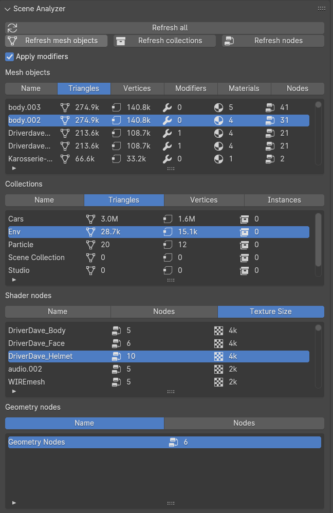

# Scene Complexity

This Blender add-on analyzes data about geometry, materials, and node trees in your scene.
It displays this information in a way that enables artists to make better decisions about optimization
by showing which objects, materials, and geometry node trees are adding the most complexity to the scene.

This add-on's panel can be found in the scene properties.

## Functionality

This add-on can analyze mesh objects, their collections.
It counts up triangle and vertex count, number of modifiers,
number of materials per mesh, and total number of nodes used in said materials.
These are displayed as columns in a table that can be sorted.

The add-on can also analyze node trees for their total node counts and the texture size used in the node tree
(specified in "2K", "4K", etc.)

The data displayed in these tables are stored as a cache (nothing saved to the file).
Use the refresh buttons at the top of the panel after making necessary changes to the file.
When "Apply Modifiers" enabled, it means the triangle and vertex count is based on if all modifiers for said mesh was applied.
This reflects the true geometry count shown in the scene.

Note that, unlike the "Statistics" counter in Blender, instanced objects are counted every time.
While obviously your render memory is used more conservatively with instanced objects, all of them are still drawn by Blender.